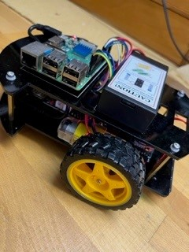

# Robocar LineTracking and induvidual steps

## mit raspberrypi

Verfasser: **Eva Stepanek**
Datum: **11.01.2023**

## 1. Einführung

Ich habe den raspberry schon länger und es hat mir sehr Spaß gemacht
mich mit dem Robo Car und dem Pi zu beschäftigen, deshalb wollte ich meine Arbeit 
mit diesem Projekt erweitern.

## 2. Projektbeschreibung

Bei diesem Projekt fährt ein Roboter Car in Steuerung vom raspberry pi 3B+ bestimmte Aufgaben.
zuerst einer schwarzen dicken Linie nach und führt auch eigene Befehle aus. 

## 3. Theorie

Ein raspberry Pi ist ein auf Linux basierender mini Computer. Er wird für die verschiedensten 
Dinge verwendet. Beispiele dafür sind Bewässerung steuern, Haushalt steuern, Roboter steuern.
Der Pi hat keine Eigene Visuelle Oberfläche, man muss ihn mit einem Bildschirm und Tastatur verbinden.

## 4. Arbeitsschritte

* Robo Car zusammenbauen laut anleitung youtube Video

* Installation VNC Viewer

* Einrichten den Pi am Laptop mit Wlan

* Linux version pi os

* Python Code downloaden und anpassen

* optische Sensoren für das Line Tracking installiert und verdratet

* getestet

* Wlan auf mobilen Hotspot geändert

* neue IP Adresse gesucht da es ja ein neues Netz ist

### Bilder

### Text

OSOYOO Raspberry Pi V2.0 car
Video auf der Homepage Lession 1 und Lession 2

## 5. Zusammenfassung

Von dem Laptop aus lässt sich durch den Raspberry das Robo Car beliebig steuern. Eine Version ist das Linetracking, hier 
muss darauf geachtet werden das die Geschwindigkeit nicht so hoch ist, denn dann fällt das Auto oft in den Kurven hinaus.
Dies ist alles durch die unten angebrachten Sensoen möglich. Ein Problem gab es auch mit dem finden der IP Adresse übers Handy.
Man muss dann einfach die möglichen Adressen pingen und schauen was sie sind.

## 6. Quellen

https://osoyoo.com/2020/08/01/osoyoo-raspberry-pi-v2-0-car-lesson-2-line-tracking/
https://de.wikipedia.org/wiki/Prozessorarchitektur
